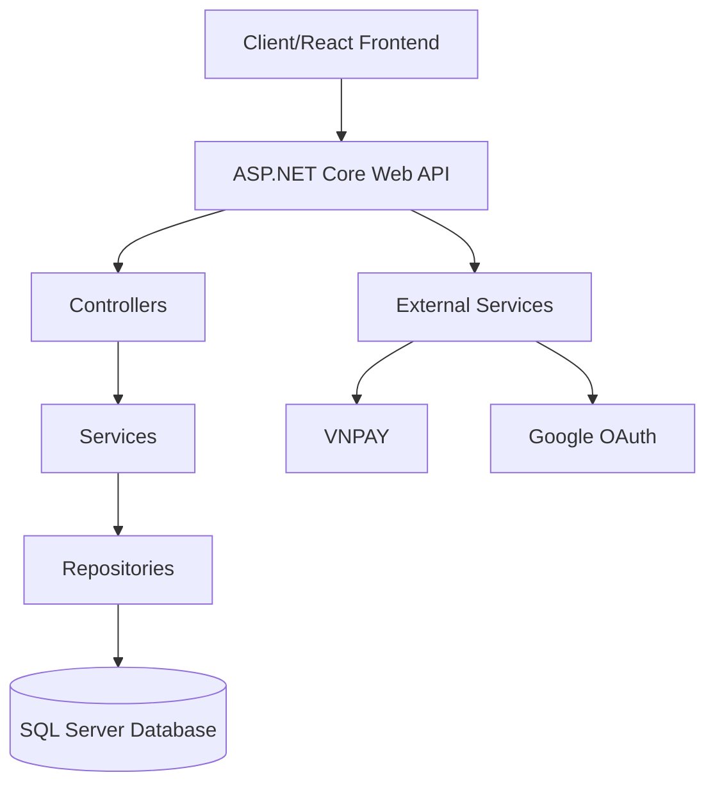

# 🎓 WebTracNghiem Online - Nền Tảng Thi Trắc Nghiệm Trực Tuyến

<p align="center">
  
</p>

<p align="center">
  <a href="#tính-năng">Tính Năng</a> •
  <a href="#công-nghệ">Công Nghệ</a> •
  <a href="#cài-đặt">Cài Đặt</a> •
  <a href="#sử-dụng">Sử Dụng</a> •
  <a href="#đóng-góp">Đóng Góp</a>
</p>

## 📝 Giới Thiệu

WebTracNghiem Online là một hệ thống thi trắc nghiệm trực tuyến toàn diện, được phát triển như một đồ án chuyên ngành. Dự án này cung cấp giải pháp hiện đại cho việc tổ chức và quản lý các kỳ thi trắc nghiệm, tạo môi trường học tập tương tác giữa giáo viên và học sinh.

### 🎯 Mục Tiêu Dự Án

- Xây dựng nền tảng thi trắc nghiệm trực tuyến an toàn và đáng tin cậy
- Tạo môi trường học tập tương tác thời gian thực
- Đơn giản hóa quá trình tổ chức và quản lý kỳ thi
- Cung cấp trải nghiệm người dùng tốt nhất cho cả giáo viên và học sinh

## ✨ Tính Năng

### 👨‍🏫 Dành Cho Giáo Viên
- Tạo và quản lý ngân hàng câu hỏi
- Tổ chức phòng học trực tuyến
- Theo dõi tiến độ học tập của học sinh
- Xuất báo cáo kết quả thi
- Tạo thông báo cho lớp học

### 👨‍🎓 Dành Cho Học Sinh
- Tham gia thi trực tuyến
- Xem lại bài làm và đáp án
- Tương tác trong phòng học trực tuyến
- Nhận thông báo từ giáo viên
- Thanh toán học phí trực tuyến

### 🔐 Bảo Mật
- Xác thực JWT
- Đăng nhập với Google
- Mã hóa dữ liệu nhạy cảm
- Phân quyền chi tiết

## 🛠 Công Nghệ

### Backend
- ASP.NET Core 8.0
- Entity Framework Core
- SQL Server
- SignalR cho real-time communication
- AutoMapper
- JWT Authentication

### Frontend (Repository riêng)
- React 18
- TypeScript
- Vite
- Tailwind CSS
- Axios
- React Query

### Tích Hợp
- MOMO Payment
- VNPAY
- Google OAuth2
- SendGrid Email

## 💾 Cài Đặt

### Yêu Cầu Hệ Thống
- .NET 8.0 SDK
- SQL Server
- Node.js (để chạy frontend)
- Visual Studio 2022 hoặc VS Code

### Các Bước Cài Đặt

1. Clone repository:

```bash
git clone https://github.com/dung4822/WebTracNghiem_DACN.git
cd WebTracNghiem_DACN
```

2. Cấu hình database:
```bash
dotnet ef database update
```

3. Cấu hình các biến môi trường trong `appsettings.json`:
```json
{
  "ConnectionStrings": {
    "DefaultConnection": "your_connection_string"
  },
  "JwtConfig": {
    "SecretKey": "your_secret_key",
    "Issuer": "your_issuer",
    "Audience": "your_audience"
  }
}
```

4. Chạy ứng dụng:
```bash
dotnet run
```

## 📱 Screenshots

<p align="center">
  
  
</p>

## 🌟 Tính Năng Nổi Bật

### Real-time Communication
- Tương tác thời gian thực trong phòng học
- Thông báo tức thì
- Chat trực tuyến

### Thanh Toán An Toàn
- Tích hợp đa dạng phương thức thanh toán
- Bảo mật thông tin thanh toán
- Lịch sử giao dịch chi tiết

### Quản Lý Bài Thi
- Tạo đề thi tự động
- Đa dạng loại câu hỏi
- Chấm điểm tự động
- Phân tích kết quả chi tiết

## 👥 Tác Giả

- **Nguyễn Đức Dũng**
  - GitHub: [dung4822](https://github.com/dung4822)
  - Email: dungnguyenduc0209@gmail.com

- **Mai Nhật Duy**
  - GitHub: [DUYNE71U3](https://github.com/DUYNE71U3)
  - Email: mainhutduy@gmail.com

## 📊 Kiến Trúc Hệ Thống




## 📄 Giấy Phép

Dự án được phát hành dưới giấy phép [MIT License](LICENSE)

## Chân Thành Cảm Ơn

Chúng tôi xin cảm ơn các thư viện mã nguồn mở đã được sử dụng trong dự án này:

- ASP.NET Core
- Entity Framework Core
- React
- Tailwind CSS
- Và nhiều thư viện khác...

---

<p align="center">Made with ❤️ in Vietnam</p>
